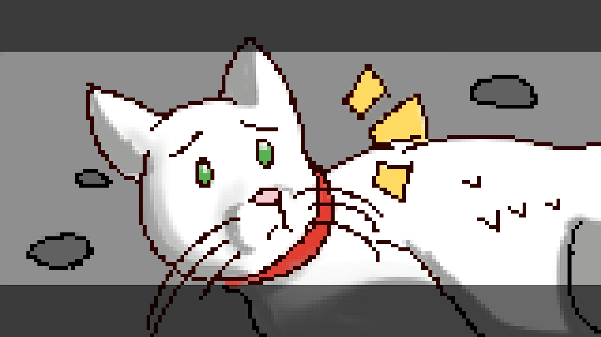
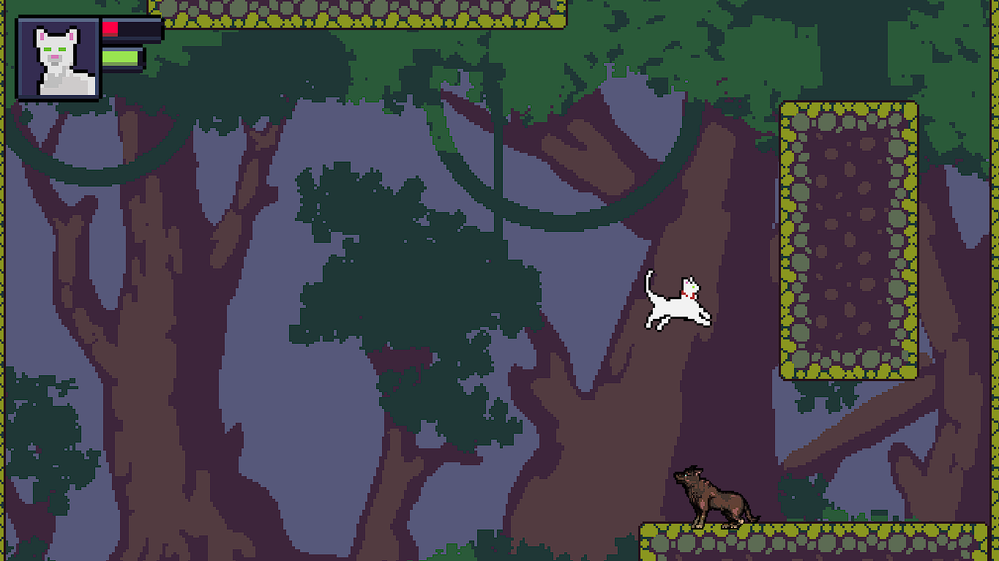
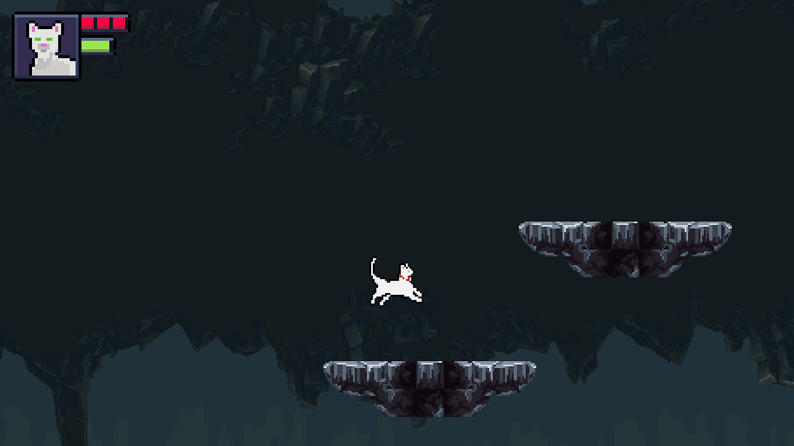
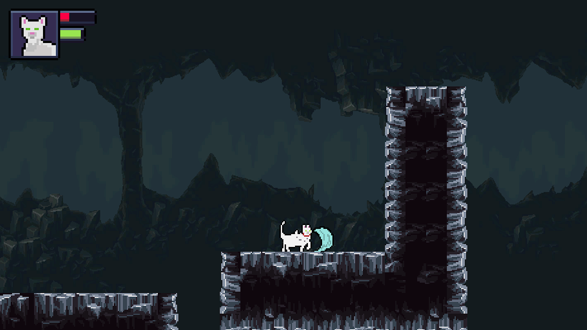

# Nimbus - A 2D Platformer Made with Unity

> A challenging 2D platformer about a cat trying to return to his friend.  
> Featuring custom art, cute cutscenes, and three unique zones with nine handcrafted levels.

---

## Overview

**Nimbus** is a difficult but heartfelt 2D platformer built in **Unity**, where you play as a cat on a journey to reunite with his friend.  
Across **3 zones** and **9 total levels**, you'll jump, climb, and dash through unique levels while uncovering small moments of story through **in-game cutscenes**.

---

## Features

- **Original character and UI art** - AlexPinekone
- **Tilesets** sourced from [Craftpix](https://craftpix.net/)  
- **3 distinct zones** with their own themes  
- **9 total levels** filled with tight platforming challenges  
- **Dash, climb, and precise movement** mechanics   
- **A difficult but rewarding experience**

---

## 🕹️ Controls

| Action | Key |
|--------|-----|
| Move | A / D or Arrow Keys |
| Jump | Space |
| Dash | Left Ctrl |
| Climb | Hold Left Shit near climbable walls |
| Attack | Z |
| Pause | Esc |

---

## Level Structure

| Zone | Levels | Theme |
|------|---------|-------|
| 1 | 1-3 | Introduction & movement mechanics |
| 2 | 4-6 | Dash and climbing challenges |
| 3 | 7-9 | Final tests and ending |

---

## Screenshots

### Cutscene

### Gameplay 1

### Gameplay 2

### Gameplay 3

---

## Development Details

- **Engine:** Unity (2D URP)
- **Language:** C#
- **Art:** Custom sprites and UI by AlexPinekone
- **Tilesets:** From creators on [Craftpix](https://craftpix.net/)  
- **Audio:** Free sound effects [Freesound](https://freesound.org/)  

---

## Play the Game

You can download **Nimbus** directly on itch.io:

**[Play on Itch.io](https://alexpinekone.itch.io/nimbus)**

---

## Lessons Learned

During development, I focused on:
- Designing responsive **player movement and dash mechanics**  
- Creating **emotional pacing** through small cutscenes   
- Balancing **level difficulty** for a "hard but fair" experience  

---

## Credits

| Asset | Creator |
|--------|----------|
| Character & UI Art | AlexPinekone |
| Tilesets | craftpix.net |
| SFX | freesound.org |
| Music | Sadness 8 bit - Pixel Beats |
---

## Developer

Created by **AlexPinekone**  
Artist • Programmer • Level Designer

With the help of **Miguel Tristan**

Itch.io: [alexpinekone.itch.io](https://alexpinekone.itch.io/)

---

## 📜 License

All code is licensed under the **MIT License**.  
Custom artwork and sprites are © 2025 AlexPinekone.

---